#  Experiment 10 — SonarQube Code Quality Analysis

---

## Overview

**SonarQube** is an open-source platform for **continuous inspection of code quality**. It performs automatic reviews using static analysis to detect:

- Bugs
-  Code Smells
-  Security Vulnerabilities

---

## Why SonarQube?

| Feature | Description |
|---|---|
| **Continuous Inspection** | Scans code with every commit, providing immediate feedback |
| **Quality Gates** | Defines pass/fail criteria for code quality |
| **Technical Debt Quantification** | Measures effort needed to fix issues |
| **Multi-language Support** | Supports 20+ programming languages |
| **Visual Analytics** | Dashboard showing code quality metrics and trends |

---

## Hands-On Lab

### Step 1 — Create `docker-compose.yml`

```bash
nano docker-compose.yml
```

```yaml
version: '3.8'

services:
  sonar-db:
    image: postgres:13
    container_name: sonar-db
    environment:
      POSTGRES_USER: sonar
      POSTGRES_PASSWORD: sonar
      POSTGRES_DB: sonarqube
    volumes:
      - sonar-db-data:/var/lib/postgresql/data
    networks:
      - sonarqube-lab

  sonarqube:
    image: sonarqube:lts-community
    container_name: sonarqube
    ports:
      - "9000:9000"
    environment:
      SONAR_JDBC_URL: jdbc:postgresql://sonar-db:5432/sonarqube
      SONAR_JDBC_USERNAME: sonar
      SONAR_JDBC_PASSWORD: sonar
    volumes:
      - sonar-data:/opt/sonarqube/data
      - sonar-extensions:/opt/sonarqube/extensions
    depends_on:
      - sonar-db
    networks:
      - sonarqube-lab

volumes:
  sonar-db-data:
  sonar-data:
  sonar-extensions:

networks:
  sonarqube-lab:
    driver: bridge
```

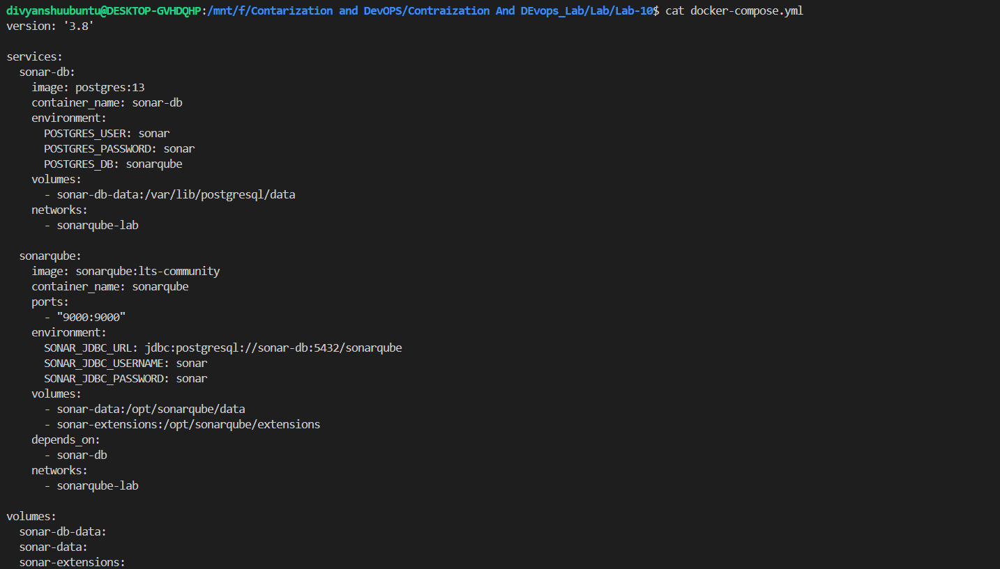

---

### Step 2 — Start the Containers

```bash
docker-compose up -d
```

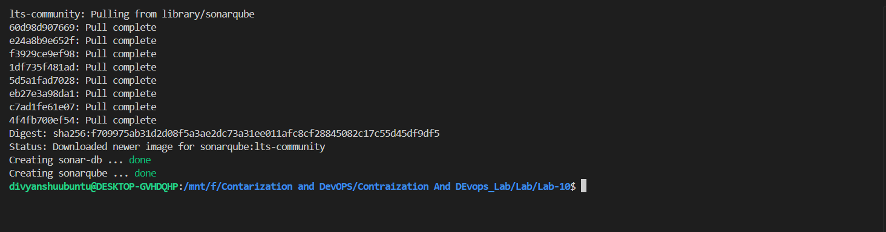

---

### Step 3 — Verify SonarQube via Logs

```bash
docker-compose logs -f sonarqube
```

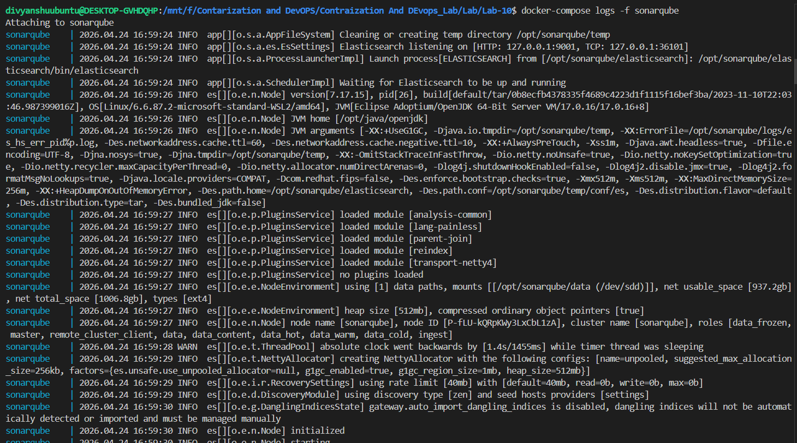

---

### Step 4 — Login to SonarQube

Open in browser:
```
http://localhost:9000
```

| Field | Value |
|---|---|
| Username | `admin` |
| Password | `admin` |


---

### Step 5 — SonarQube Home Page

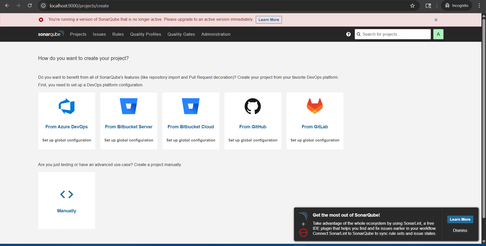

---

### Step 6 — Create a Sample Java App

```bash
mkdir -p sample-java-app/src/main/java/com/example
cd sample-java-app
```

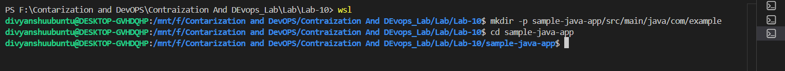

---

### Step 7 — Create `Calculator.java`

```bash
nano src/main/java/com/example/Calculator.java
```

```java
package com.example;

public class Calculator {

    
    public int divide(int a, int b) {
        return a / b;
    }

    
    public int add(int a, int b) {
        int result = a + b;
        int unused = 100;
        return result;
    }

    
    public String getUser(String userId) {
        String query = "SELECT * FROM users WHERE id = " + userId;
        return query;
    }

    
    public int multiply(int a, int b) {
        int result = 0;
        for (int i = 0; i < b; i++) {
            result = result + a;
        }
        return result;
    }

    public int multiplyAlt(int a, int b) {
        int result = 0;
        for (int i = 0; i < b; i++) {
            result = result + a;
        }
        return result;
    }

    public String getName(String name) {
        return name.toUpperCase();
    }

    
    public void riskyOperation() {
        try {
            int x = 10 / 0;
        } 
    }
}
```

> **Note:** This file is intentionally crafted with common issues so SonarQube can detect and report them.

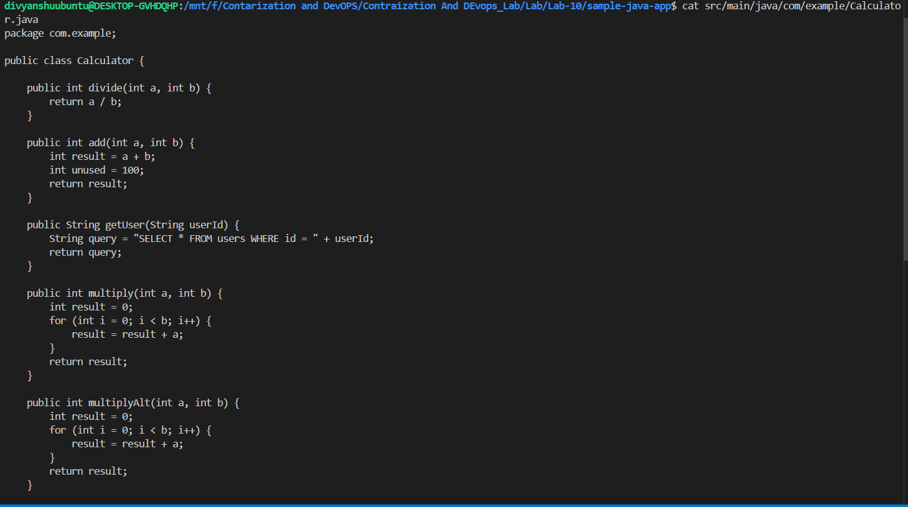

---

### Step 8 — Create `pom.xml`

```bash
nano pom.xml
```

```xml
<project xmlns="http://maven.apache.org/POM/4.0.0">
    <modelVersion>4.0.0</modelVersion>

    <groupId>com.example</groupId>
    <artifactId>sample-app</artifactId>
    <version>1.0-SNAPSHOT</version>

    <properties>
        <sonar.projectKey>sample-java-app</sonar.projectKey>
        <sonar.host.url>http://localhost:9000</sonar.host.url>
        <sonar.login>YOUR_TOKEN</sonar.login>
    </properties>

    <build>
        <plugins>
            <plugin>
                <groupId>org.sonarsource.scanner.maven</groupId>
                <artifactId>sonar-maven-plugin</artifactId>
                <version>3.9.1.2184</version>
            </plugin>
        </plugins>
    </build>
</project>
```

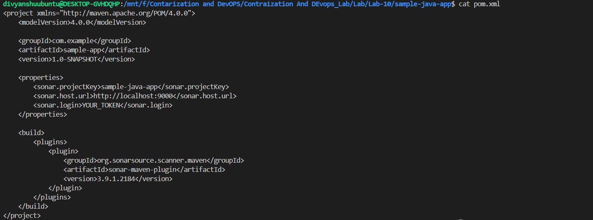

---

### Step 9 — Generate a Scanner Token

Navigate to:
```
Profile → My Account → Security → Generate Token
```

- **Token Name:** `scanner-token`
- Click **Generate** and copy the token

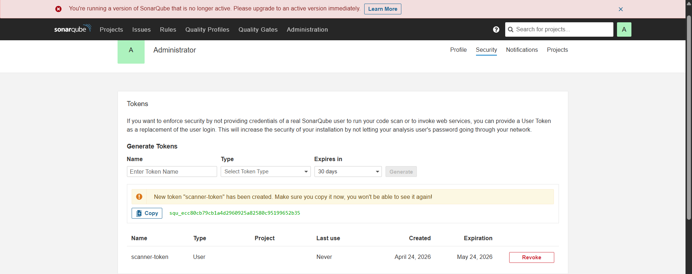

---

### Step 10 — Run the Sonar Scanner

```bash
mvn sonar:sonar -Dsonar.login=YOUR_TOKEN
```

> Replace `YOUR_TOKEN` with the token generated in Step 9.

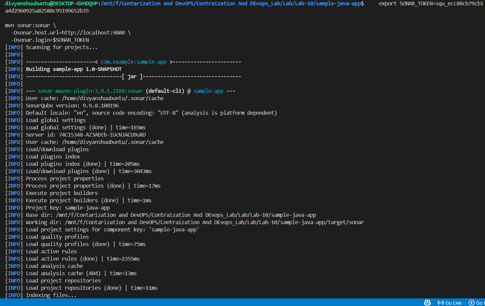

---

### Step 11 — Confirm Build Success

Scroll down in the terminal output to verify:

```
[INFO] BUILD SUCCESS
```

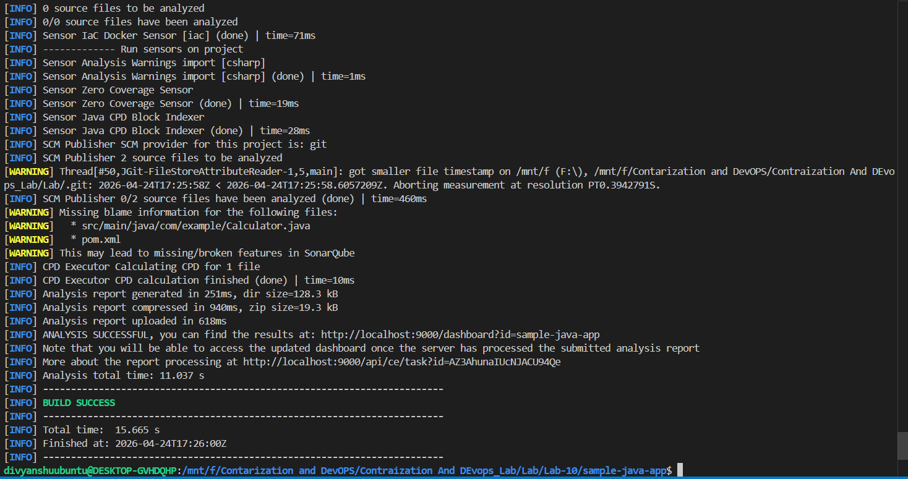

---

### Step 12 — View Results in Browser

Open SonarQube dashboard at `http://localhost:9000` — your project analysis will be listed.

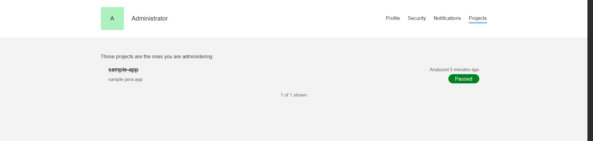

---

### Step 13 — Explore the Full Report

Click on your project to drill into the detailed quality report including bugs, vulnerabilities, code smells, and duplications.

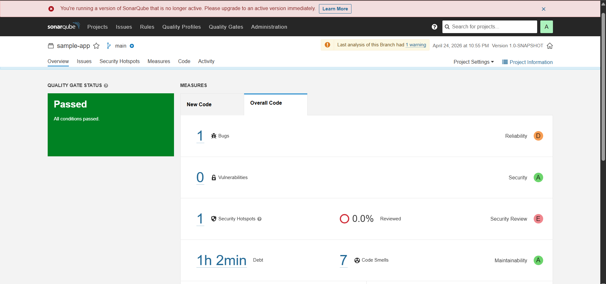

---

## Summary

In this experiment, you:

1. Deployed **SonarQube + PostgreSQL** using Docker Compose
2. Created a sample **Java application** with intentional code issues
3. Configured **Maven** for Sonar integration
4. Generated a **security token** for authenticated scanning
5. Ran the **Sonar scanner** and reviewed the quality report

---


