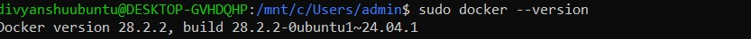
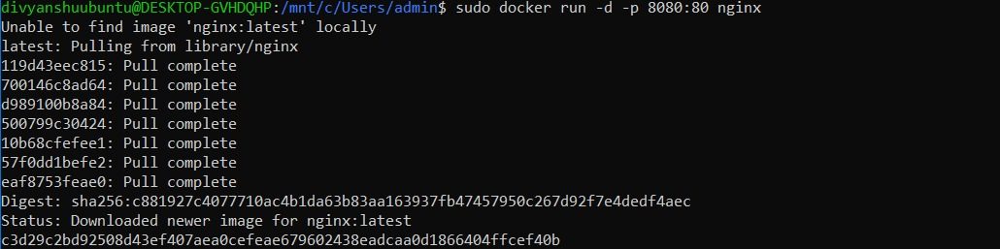
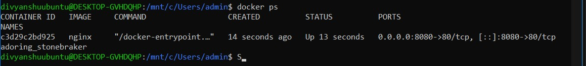
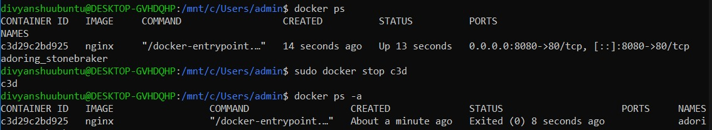
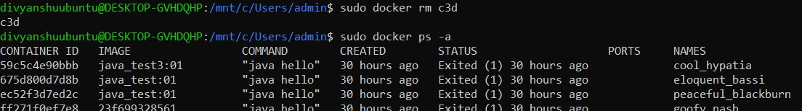
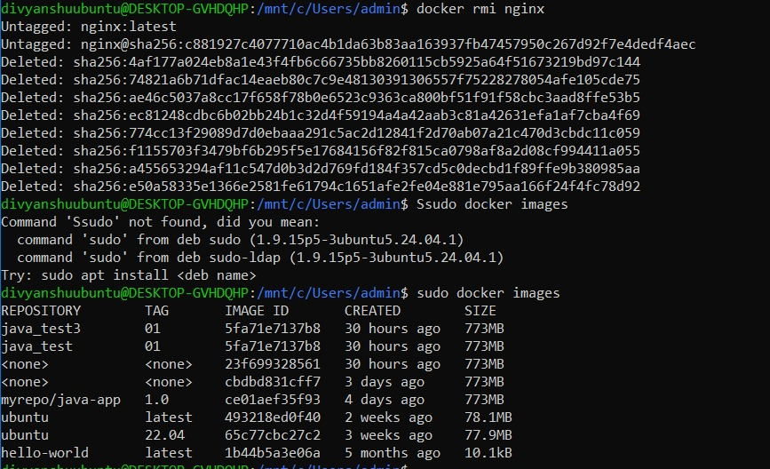

# Contraization And Devops
## Lab 2

## Student Details
- **Name:** Divyanshu Singh  
- **Course:** B.Tech  
- **SAP ID:** 500122856  
- **Subject:** DevOps Lab  
- **Semester:** 6  

---

## Step-by-Step Procedure

#### 🔹 Step 1: Checking Docker Installation / Initial Setup

---

#### Step 2: Installing Docker Packages

---

#### Step 3: Verifying Docker Version

---

#### Step 4: Running Docker Service

---

#### Step 5: Running a Docker Container

---

#### Step 6: Listing Docker Images and Containers

---

