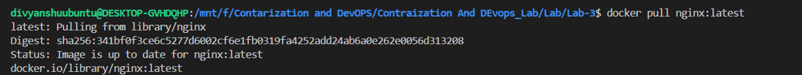
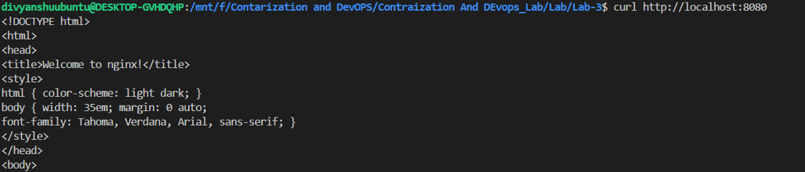
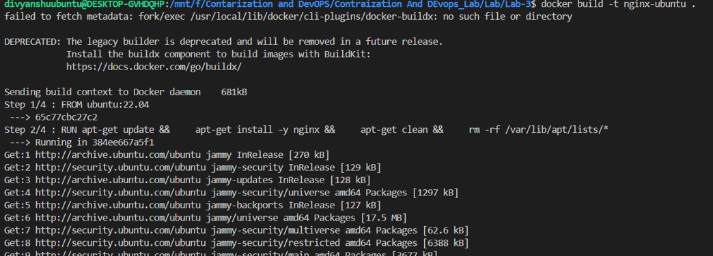
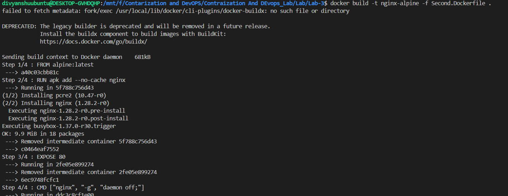
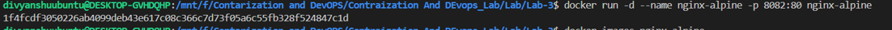
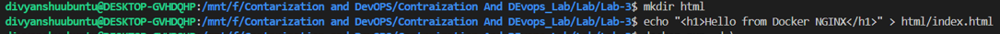
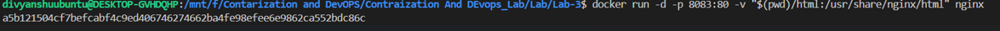
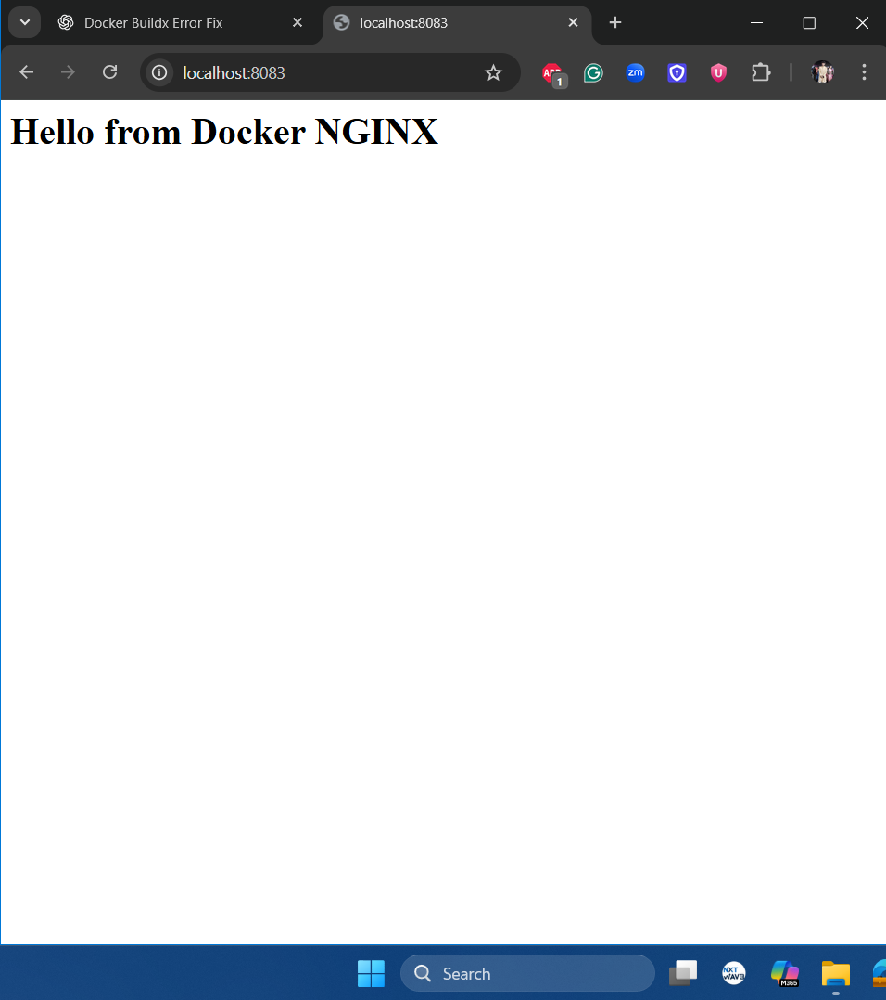

# Deploying NGINX Using Different Base Images and Comparing Image Layers

---

## Lab Objectives

After completing this lab, students will be able to:

* Deploy NGINX using:

  * Official `nginx` image
  * Ubuntu-based image
  * Alpine-based image
* Understand Docker image layers and size differences
* Compare performance, security, and use-cases of each approach
* Explain real-world use of NGINX in containerized systems

---

## Prerequisites

* Docker installed and running
* Basic knowledge of:

  * `docker run`
  * `Dockerfile`
  * Port mapping
* Linux command basics

---

## Part 1: Deploy NGINX Using Official Image (Recommended Approach)

### Step 1: Pull the Image

```bash
docker pull nginx:latest
```


### Step 2: Run the Container

```bash
docker run -d --name nginx-official -p 8080:80 nginx
```

### Step 3: Verify

```bash
curl http://localhost:8080
```


You should see the **NGINX welcome page**.

---

## Part 2: Custom NGINX Using Ubuntu Base Image

### Step 1: Create Dockerfile

```Dockerfile
FROM ubuntu:22.04

RUN apt-get update && \
    apt-get install -y nginx && \
    apt-get clean && \
    rm -rf /var/lib/apt/lists/*

EXPOSE 80

CMD ["nginx", "-g", "daemon off;"]

```


### Step 2: Build Image

```bash
docker build -t nginx-ubuntu .
```


### Step 3: Run Container

```bash
docker run -d --name nginx-ubuntu -p 8081:80 nginx-ubuntu
```

---

### Observations

```bash
docker images nginx-ubuntu
```


* Much **larger image size**
* More layers
* Full OS utilities available

---

## Part 3: Custom NGINX Using Alpine Base Image

### Step 1: Create Dockerfile

```Dockerfile
FROM alpine:latest

RUN apk add --no-cache nginx

EXPOSE 80

CMD ["nginx", "-g", "daemon off;"]
```


### Step 2: Build Image

```bash
docker build -t nginx-alpine .
```


### Step 3: Run Container

```bash
docker run -d --name nginx-alpine -p 8082:80 nginx-alpine
```

---

### Observations

```bash
docker images nginx-alpine
```


* Extremely **small image**
* Fewer packages
* Faster pull and startup time

---

## Part 4: Image Size and Layer Comparison

### Compare Sizes

```bash
docker images | grep nginx
```


Typical result (approx):

| Image Type   | Size      |
| ------------ | --------- |
| nginx:latest | ~140 MB   |
| nginx-ubuntu | ~220+ MB  |
| nginx-alpine | ~25–30 MB |

---

### Inspect Layers

```bash
docker history nginx
docker history nginx-ubuntu
docker history nginx-alpine
```

Observations:

* Ubuntu has many filesystem layers
* Alpine has minimal layers
* Official NGINX image is optimized but heavier than Alpine

---

## Part 5: Functional Tasks Using NGINX

### Task 1: Serve Custom HTML Page

```bash
mkdir html
echo "<h1>Hello from Docker NGINX</h1>" > html/index.html
```

Run:

```bash
docker run -d \
  -p 8083:80 \
  -v $(pwd)/html:/usr/share/nginx/html \
  nginx
```



# Thank You
---