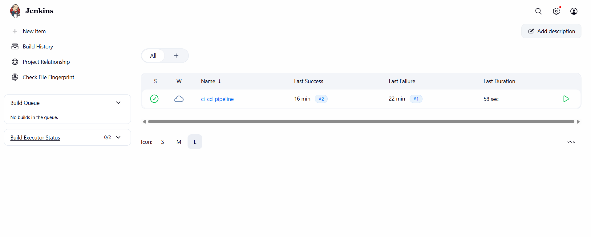
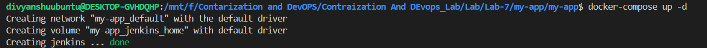
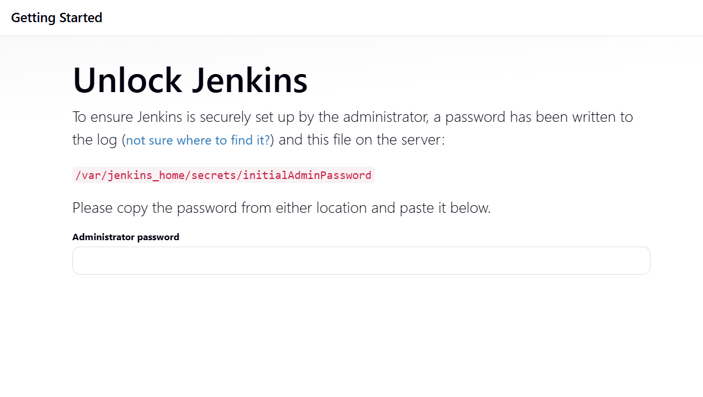
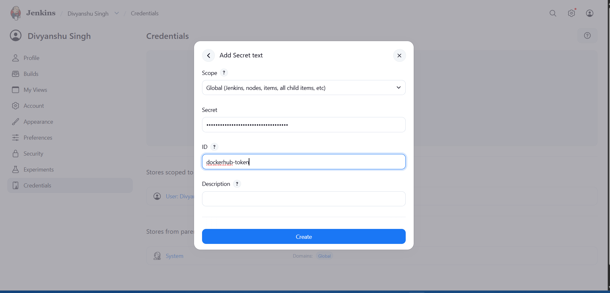
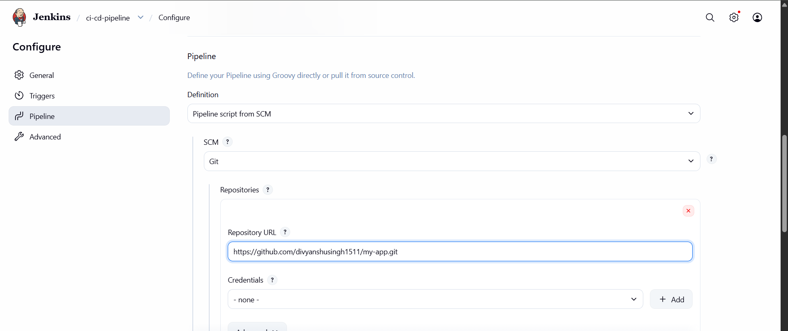
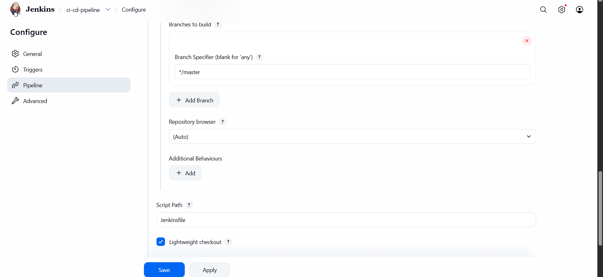
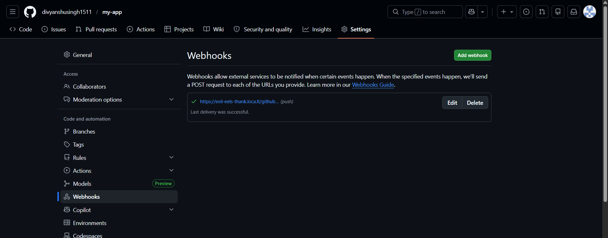
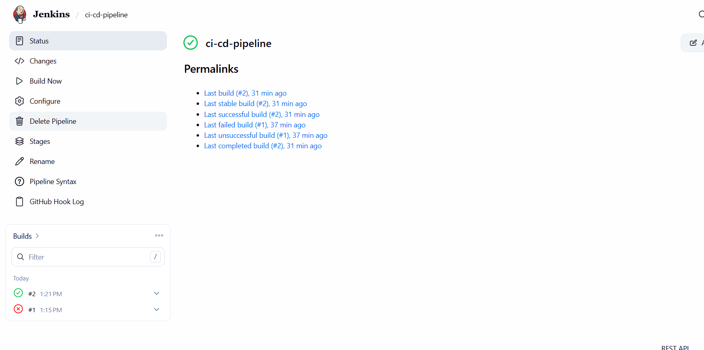
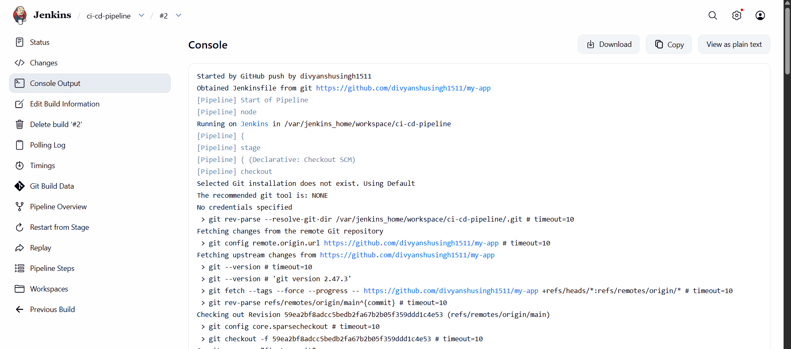

# Lab Experiment 7: CI/CD using Jenkins, GitHub and Docker Hub

> **Course:** DevOps | **Student:** Divyanshu Singh | **SAP ID:** 500122856 | **University:** UPES, Dehradun

---

## Table of Contents

1. [Aim](#aim)
2. [Objectives](#objectives)
3. [Theory](#theory)
4. [Prerequisites](#prerequisites)
5. [Part A – GitHub Repository Setup](#part-a--github-repository-setup)
6. [Part B – Jenkins Setup using Docker](#part-b--jenkins-setup-using-docker)
7. [Part C – Jenkins Configuration](#part-c--jenkins-configuration)
8. [Part D – GitHub Webhook Integration](#part-d--github-webhook-integration)
9. [Part E – Execution Flow](#part-e--execution-flow)
10. [Screenshots](#screenshots)
11. [Observations](#observations)
12. [Result](#result)


---

## Aim

To design and implement a complete CI/CD pipeline using **Jenkins**, integrating source code from **GitHub**, and building & pushing Docker images to **Docker Hub**.

---

## Objectives

- Understand CI/CD workflow using Jenkins (GUI-based tool)
- Create a structured GitHub repository with application + Jenkinsfile
- Build Docker images from source code
- Securely store Docker Hub credentials in Jenkins
- Automate build & push process using webhook triggers
- Use same host (Docker) as Jenkins agent

---

## Theory

### What is Jenkins?

Jenkins is a **web-based GUI automation server** used to build applications, test code, and deploy software. It provides:

- A browser-based dashboard
- A rich plugin ecosystem (GitHub, Docker, etc.)
- Pipeline as Code using a `Jenkinsfile`

### What is CI/CD?

| Term | Definition |
|------|-----------|
| **Continuous Integration (CI)** | Code is automatically built and tested after each commit |
| **Continuous Deployment (CD)** | Built artifacts (Docker images) are automatically delivered/deployed |

### Workflow Overview

```
Developer → GitHub → Webhook → Jenkins → Build → Docker Hub
```

---

## Prerequisites

- Docker & Docker Compose installed
- GitHub account
- Docker Hub account
- Basic Linux command knowledge

---

## Part A – GitHub Repository Setup

### 5.1 Create Repository

Create a repository on GitHub named `my-app`.

### 5.2 Project Structure

```
my-app/
├── app.py
├── requirements.txt
├── Dockerfile
└── Jenkinsfile
```

### 5.3 Application Code

**`app.py`**
```python
from flask import Flask
app = Flask(__name__)

@app.route("/")
def home():
    return "Hello from CI/CD Pipeline! DIVYANSHU SINGH is here!\n Change: Checking if the pipeline is working fine."
    #return "Hello from CI/CD Pipeline!, my sapid is 500122856"

app.run(host="0.0.0.0", port=80)

```

**`requirements.txt`**
```
flask
```

### 5.4 Dockerfile

```dockerfile
FROM python:3.10-slim

WORKDIR /app
COPY . .

RUN pip install -r requirements.txt

EXPOSE 80
CMD ["python", "app.py"]
```

**Build Process:**
1. Source code is pushed to GitHub
2. Jenkins pulls the code
3. Dockerfile creates the environment, installs dependencies, and packages the app
4. Output → Docker Image

### 5.5 Jenkinsfile

```groovy
pipeline {
    agent any

    environment {
        IMAGE_NAME = "divyanshusingh151103/myapp"
    }

    stages {

        stage('Clone Source') {
            steps {
                git branch: 'main', url: 'https://github.com/divyanshusingh1511/my-app.git'
            }
        }

        stage('Build Docker Image') {
            steps {
                sh 'docker build -t $IMAGE_NAME:latest .'
            }
        }

        stage('Login to Docker Hub') {
            steps {
                withCredentials([string(credentialsId: 'dockerhub-token', variable: 'DOCKER_TOKEN')]) {
                    sh 'echo $DOCKER_TOKEN | docker login -u divyanshusingh151103 --password-stdin'
                }
            }
        }

        stage('Push to Docker Hub') {
            steps {
                sh 'docker push $IMAGE_NAME:latest'
            }
        }
    }
}
```

---

## Part B – Jenkins Setup using Docker

### 6.1 Docker Compose File

```yaml
version: '3.8'

services:
  jenkins:
    image: jenkins/jenkins:lts
    container_name: jenkins
    restart: always
    ports:
      - "8080:8080"
      - "50000:50000"
    volumes:
      - jenkins_home:/var/jenkins_home
      - /var/run/docker.sock:/var/run/docker.sock
    user: root

volumes:
  jenkins_home:
```

### 6.2 Start Jenkins

```bash
docker-compose up -d
```

Access Jenkins at: `http://localhost:8080`

### 6.3 Unlock Jenkins

```bash
docker exec -it jenkins cat /var/jenkins_home/secrets/initialAdminPassword
```

### 6.4 Initial Setup

1. Install suggested plugins
2. Create admin user

---

## Part C – Jenkins Configuration

### 7.1 Add Docker Hub Credentials

Navigate to:
```
Manage Jenkins → Credentials → Add Credentials
```

| Field | Value |
|-------|-------|
| Type | Secret Text |
| ID | `dockerhub-token` |
| Value | Docker Hub Access Token |

### 7.2 Create Pipeline Job

1. **New Item → Pipeline**
2. **Name:** `ci-cd-pipeline`
3. **Configure:** Pipeline script from SCM
   - SCM: Git
   - Repo URL: your GitHub repo URL
   - Script Path: `Jenkinsfile`

---

## Part D – GitHub Webhook Integration

### 8.1 Configure Webhook

In GitHub, go to:
```
Settings → Webhooks → Add Webhook
```

| Field | Value |
|-------|-------|
| Payload URL | `http://<your-server-ip>:8080/github-webhook/` |
| Content Type | `application/json` |
| Events | Push events |

---

## Part E – Execution Flow

```
Stage 1: Code Push        →  Developer updates code in GitHub
Stage 2: Webhook Trigger  →  GitHub sends push event to Jenkins
Stage 3: Clone            →  Jenkins pulls latest code from GitHub
Stage 4: Build            →  Docker builds image using Dockerfile
Stage 5: Auth             →  Jenkins logs into Docker Hub using stored token
Stage 6: Push             →  Image pushed to Docker Hub
Stage 7: Artifact Ready   →  Docker image available globally
```

### Role of Same Host Agent

Jenkins runs inside Docker with the Docker socket mounted:
```
/var/run/docker.sock
```
This allows Jenkins to directly control the host Docker daemon — building and pushing images without a separate agent.

---

## Screenshots

> **Instructions:** Replace each placeholder below with your actual screenshot.  
> To add a screenshot: save the image in the same folder as this README, then update the path.

### 1. Jenkins Dashboard
<!-- Replace the path below with your actual screenshot filename -->




### 2. Docker Compose Up – Jenkins Container Running




### 3. Jenkins Initial Unlock Screen




### 4. Adding Docker Hub Credentials in Jenkins




### 5. Pipeline Job Configuration (SCM Settings)





### 6. GitHub Webhook Configuration




### 7. Jenkins Pipeline Execution – Stage View




### 8. Console Output – Successful Build & Push




> **Tip:** Create a `screenshots/` folder in your repo and drop all images there.  
> Then remove the triple backticks (` ``` `) around each image tag to make them render properly.

---

## Observations

- Jenkins GUI simplifies CI/CD management through a visual stage view
- GitHub acts as both source repository and pipeline definition host
- Docker ensures consistent, reproducible builds across environments
- Webhooks enable fully automatic, event-driven pipeline execution
- Storing credentials in Jenkins prevents secrets from being hardcoded in source code

---

## Result

Successfully implemented a complete CI/CD pipeline where:

- Source code and pipeline definition are maintained in GitHub
- Jenkins automatically detects changes via webhook triggers
- Docker image is built directly on the host agent
- Image is securely pushed to Docker Hub using stored credentials

---
